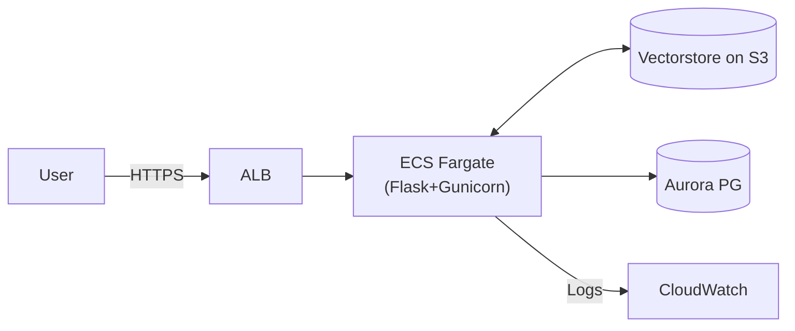

# **1. ETL Pipeline Overview (Data Ingestion)**

The ETL pipeline is designed to prepare regulatory web content for semantic search and retrieval-augmented generation (RAG). It consists of three primary stages:

---
### **1.1 Extraction Phase**

#### Objective:
Scrape data from desired URL (e.g., §1024.17), follow relevant nested links, and save structured markdowns for each section with traceable metadata.

#### Components:
| Step | Script | Description |
|------|--------|-------------|
| Base Extraction | `scraper.py` | Downloads Parent(Base) page using `AsyncWebCrawler`, and saves cleaned markdown using `save_markdown_and_mapping()`. |
| One-Hop Link Discovery | `extract_nested_links.py` | Extracts one-hop nested URLs from downloaded markdown using regex and filters irrelevant links. |
| Nested Content Scraping | `extract_nested_data.py` | Downloads content from discovered links, processes with `extract_section()` from `scraper`, and saves markdowns + metadata. |

#### Why AsyncWebCrawler instead of BeautifulSoup?:
The custom crawler offers parallel processing capabilities, rate limiting, and retry logic specifically designed for regulatory sites that may have complex navigation patterns or strict access controls.

#### Output:
- Clean markdowns: `data/markdown_files/`
- Link metadata: `data/raw/links/`
- File mapping: `url_to_file.json`

---

### 1.2 Transformation Phase

#### Objective:
Break down long markdown documents into chunks for vectorization and retrieval.

#### Steps:

1. **Load Markdown Files:**  
   Reads `.md` files from `data/markdown_files/`.

2. **Select Chunking Strategy:**  
   Configurable via `RAG_CONFIG["Chunk_param"]`. Supported strategies:
   - `semantic_chunking`: Sentence embeddings + fallback.
   - `sentence_token_chunking`: Sentence/token boundaries.
   - `recursive_chunking`: Character-based splitting.

3. **Wrap Chunks with Metadata:**  
   Each chunk is turned into a `LangChain Document` with:
   - `source`, `filename`, `chunk_type`, `chunk_index`

4. **Save Strategy Metadata:**  
   Each run saves a `chunk_params.json` in the vectorstore directory.

#### Output:
- In-memory documents list: `List[Document]`
- Configured chunk metadata in:  
  `data/vector_stores/<strategy>_*/chunk_params.json`

---

### 1.3 Load Phase

#### Objective:
Persist the document chunks into a vector store and enable efficient retrieval for question answering.

#### Steps:

1. **Vector Store Setup:**  
   Uses Chroma and openai-embeddings to create and  embed each chunk and stores them under a collection tied to its chunking strategy.

2. **Retriever Options:**
   - `BasicRetriever`: Pure embedding similarity.
   - `BM25RerankedRetriever`: Embedding + BM25 re-ranking.
   - `ReciprocalRankFusionRetriever`: Combines results via Recursice Rank Fusion.

3. **Query Handling with RAG Chain:**
   - Fetches documents using retriever.
   - Constructs prompt + context with retrieved context as reference.
   - Sends to LLM (e.g., GPT-4o-mini) for grounded response.

#### Output:
- Vector store directories: `data/vector_stores/`
- Retriever setup and prompt handling through: `RAGChain`
----

### 1.4 Vectorstore Deployment to AWS cloud

After the Load phase, vectorstores could be dumped to Amazon S3 for centralized storage, enabling  ECS containers to load/interact with them  during inference or app startup.

#### 1. Dumping Vectorstore to Amazon S3
- Serialize Vectorstore ( e.g- using the josn file in the vectorstore directory  or 
Chroma’s native serialization )

- Dump all the vectorstore files into a staging directory

#### 2. Configure and Upload to S3

- Define path to S3 bucket in the config file (e.g- RAG_CONFIG["S3_BUCKET"], ["VECTORSTORE_PREFIX"]) 

- Ensure that IAM Role must allow write permissons to the bucket (s3:PutObject for the bucket)

- (Optional) Post-upload Validation/tracability to ensure expected files are present by logging S3 URLs or versioning metadata

#### 3. Runtime Retrieval in ECS via CI/CD Integration
- Once uploaded to S3, the vectorstore will be the source of truth for containerized deployments.

CI/CD Workflow:
- Triggered post-ETL after vectorstore is uploaded to S3 

- ECS Pull Phase - At container initialization time vectorstore is connected with the ECS container so that the retriever can pull out the relevant vecots based on a user query.
----
#### **Note: Vectorstore interaction Strategies**

There can be 3 approaches that could be implemented for vectorstore management, balancing access speed and consistency
(depending on usage)

#### **1. Pure S3-Based Approach**
- **Storage Location**: All vectorstores are persisted in S3 as the single source of truth.
- **Access Pattern**: ECS tasks loads vectorstore files from S3 on-demand during runtime.
- **Advantages**:
  - Centralized and version-controlled storage
  - Scales independently of compute
  - Enables backup and disaster recovery
- **Tradeoffs**:
  - Higher latency for access unless cached locally
  - Dependent on network availability and S3 read performance

#### **2. Co-located Approach**
- **Storage Location**: Vectorstore is included directly within the ECS container image or mounted via attached EBS volumes.
- **Access Pattern**: Vectorstore is immediately available to the application at container startup with no external downloads.
- **Advantages**:
  - Low-latency access
  - No runtime dependency on external network or S3
- **Tradeoffs**:
  - Larger container images or EBS provisioning overhead
  - Increased build and deployment times
  - Harder to manage versioning across environments

#### **3. Hybrid Approach**
- **Storage Location**: S3 remains the authoritative source; a subset is cached locally within ECS containers.
- **Access Pattern**: Frequently accessed vectors are loaded into memory or local disk cache; others fetched from S3 as needed.
- **Advantages**:
  - Balances scalability with performance
  - Reduces latency for common queries
- **Tradeoffs**:
  - Requires background sync or cache refresh logic
  - Slightly higher operational complexity

---

# **2. AWS Infrastructure Overview**

After the ETL pipeline completes and the vectorstore is generated, this section outlines the AWS services and architecture that can be used to deploy the RAG-based chatbot application.

 **Assumption** : The chatbot experiences intermittent usage patterns with occasional spikes (e.g., during business hours rather than constant, uniform traffic. By leveraging serverless container orchestration, we could optimize costs—paying only for compute when tasks are running—while ensuring rapid scaling during peak demand.

**Why ECS Fargate?** 
- Auto-scaling & Cost Efficiency: Fargate scales containers as needed, cutting idle EC2 costs.

- Managed Infrastructure: AWS handles patching, provisioning, and cluster management.

- Support for Long-running Processes: ECS tasks can run persistent services (e.g., Gunicorn) with custom entrypoints, unlike Lambda.


Here is a list of AWS Services that would be needed to implement the ECS based approach :

| Component       | Service                | Purpose                                                       |
|-----------------|------------------------|---------------------------------------------------------------|
| **Compute**     | Amazon ECS + Fargate   | Serverless containers for chatbot API                         |
| **Load Balancer** | ALB                   | Distribute traffic, SSL termination, health checks            |
| **Database**    | Amazon RDS Aurora PG   | Persistent storage for chats, logs, feedbacks, metrics                   |
| **Networking**  | VPC, Subnets, NAT GW   | Secure network segmentation and outbound internet access      |
| **Registry**    | Amazon ECR             | Docker image storage with scanning & lifecycle policies       |
| **Observability** | CloudWatch + SNS     | Logs, metrics, alarms, notifications                          |
| **Security**    | IAM Roles, SGs         | Least-privilege access, secure network rules                  |


###  **AWS Infrastructure Components for RAG Chatbot Deployment**

| **Category**       | **AWS Service(s)**            | **Purpose**                                                                 |
|--------------------|-------------------------------|------------------------------------------------------------------------------|
| **Compute**        | Amazon ECS + AWS Fargate      | Run containerized chatbot APIs without managing servers                      |
| **Networking**     | VPC, Subnets, NAT Gateway     | Enable secure, segmented networking and controlled outbound access           |
| **Load Balancing** | Application Load Balancer     | Route incoming traffic, handle SSL termination, perform health checks        |
| **Storage (Images)** | Amazon Elastic Container Registry (ECR) | Store Docker images with vulnerability scanning and lifecycle management    |
| **Database**       | Amazon RDS (Aurora PostgreSQL) | Store structured data: user interactions, feedback, logs, and metrics       |
| **Observability**  | Amazon CloudWatch + SNS       | Monitor logs, set up alarms, and send notifications                          |
| **Security**       | IAM Roles, Security Groups     | Enforce least-privilege access and manage traffic via network firewall rules |


### 2.1 Compute: ECS on Fargate

- **Docker Image**: Built in CI, pushed to ECR.
- **Task Definition**: Defines container, env vars, secrets (via Secrets Manager), log config.
- **Service**: Maintains `min=2` tasks for HA, auto-scales based on CPU/memory.
- **Entrypoint**: `supervisord` runs Gunicorn → Flask app (`app.py`).

### 2.2 Load Balancer: Application Load Balancer (ALB)

- **Placement**: Public subnet
- **Listeners**: HTTP (80) → HTTPS (443) redirect
- **SSL**: ACM certificate on TLS listener
- **Health Check**: `/health` endpoint
- **Target Group**: Points to ECS tasks on port `8080`

### 2.3 Database: Aurora PostgreSQL

- **Deployment**: Multi-AZ for failover
- **Storage**:  
  - Chat logs  
  - Query history  
  - Debug & error logs  
  - Usage metrics  
  - (Optional) Langfuse ( for LLM tracing, observability ( discussed in LLM tracing))
- **Connection**: ECS tasks via Security Group
- **Credentials**: Stored in Secrets Manager

### 2.4 Networking: VPC & Subnets

- **VPC**: Custom CIDR (e.g., `10.0.0.0/16`)
- **Subnets**:
  - Public: ALB
  - Private: ECS & RDS
- **NAT Gateway**: Enables ECS tasks to call external APIs (e.g., OpenAI)
- **Route Tables**: Public subnet → IGW; Private subnet → NAT GW

### 2.5 Container Registry: ECR

- **Repo**: Private, auto-scan on push
- **Lifecycle Policy**: Retain latest N images, expire old ones
- **Permissions**: ECS tasks pull via IAM role

### 2.6 Observability: CloudWatch + SNS

- **Logs**: ECS task logs → CloudWatch Log Groups
- **Alarms**:
  - ECS CPU/Memory > thresholds
  - RDS CPU/Storage anomalies
  - ALB 5xx errors
- **Notifications**: SNS topics for email/SMS alerts

### 2.7 Security: IAM & Security Groups

| Resource        | Access Policy                                 |
|-----------------|-----------------------------------------------|
| ECS Task Role   | ECR Pull, S3 Read, Secrets Manager access     |
| ALB SG          | Ingress: 80/443 from 0.0.0.0/0                |
| ECS SG          | Ingress: 8080 from ALB SG                     |
| RDS SG          | Ingress: 5432 from ECS SG                     |

---
### 2.8 API Endpoints (in `app.py`) -- (flask wrapped )

| Path    | Method | Purpose                       |
|---------|--------|-------------------------------|
| `/query` | POST  | Handles user queries via RAG  |
| `/health`| GET   | Health check for ALB & ECS    |


### 2.9 Test Environment (EC2-based)

To mirror production as closely as possible while allowing safe testing of new features, we cloud provision EC2-based environment:

| Instance | Role                 | Description                                      |
|----------|----------------------|--------------------------------------------------|
| `EC2-1`  | App Server           | Flask+Gunicorn+Supervisord |
| `EC2-2`  | DB Server            | Vectorstores, PostgreSQL etc                       |

- **Application**: Flask app served by Gunicorn, managed by Supervisord
- **Security Group**: Only allows port 5432 from EC2‑1 SG 
- **Networking**: Mirror prod VPC/subnet setup, SG rules identical.
- **Logs**: Local + CloudWatch Agent installed.

---

**Diagram: High-Level Traffic Flow**



-----
# 3. **CI/CD & MLOps Pipeline**

This section outlines the Continuous Integration, Continuous Deployment, and MLOps processes that could be used to move the chatbot (and its ETL artifacts) from development through test to production.

### 3.1 Multi-Branch Strategy 

This section outlines the Continuous Integration, Continuous Deployment, and MLOps processes designed to move the RAG chatbot (and its ETL artifacts) through development, testing, and production environments with maximum reliability and minimal friction.


| Branch        | Environment        | Purpose                                       |
|---------------|--------------------|--------------------------------------------- |
| `main`        | Production (ECS)   | Stable, user-facing release                   |
| `test`        | Staging (EC2)      | QA and integration testing                    |
| `feature/*`   | Local/Dev          | Feature development and previews              |

### **3.2 Production CI/CD Workflow (ECS via GitHub Actions)**

Based on the AWS features and strategies and assumptions mentioned in section 1 and 2 here is a high level prod ci/cd pipeline implementation- 

---

#### 1. **Triggering the Workflow**
  - Automatically on any push or merge into the `main` branch.  
  - Can also be manually dispatched with parameters for vectorstore build options and interaction strategy (e.g. "colocated", "s3-only", etc).
---
<!-- #### 2. **Environment Setup & Validation( needed or not?)**

- **Checkout the repository** so that workflow can access the app code.
- **Set up Python 3.10** in the GitHub runner.
- **Install dependencies** using `requirements.txt` for runtime and `requirements-dev.txt` for testing/linting/dev tools. -->
<!-- 
```plaintext
Step:
- Checkout the repo
- Set Python version to 3.10
- Install runtime and dev dependencies using pip
``` -->
---
#### 3. **Code Quality & Test Suite(remove)**

- Run a **linter** (e.g., flake8) to catch code style issues.
- Run **unit tests** under `tests/unit` to verify basic app logic.
- Run a **security scan** to detect vulnerabilities in dependencies (e.g., Anchore or Trivy).

```plaintext
Step:
- Lint the codebase to ensure consistent style
- Execute unit tests to catch regressions
- Perform a dependency vulnerability scan
```

#### 4. **ETL Pipeline Validation( should remove this ?)**

- Run **unit tests for the ETL pipeline**, located under `tests/etl`.
- Optionally run a **sample vectorstore generation** to ensure embeddings and document processing works.

```plaintext
Step:
- Test the ETL pipeline components
- Run sample vectorstore generation for basic validation
```

and put this instead-

4. Vectorstore Reference Validation
Verify that the expected vectorstore version exists in S3.

If missing, fail the pipeline early with a clear error message.
`aws s3 ls s3://your-bucket/vectorstores/$`{vectorstore_version}/ || fail


or optionally - 

4. Build Docker Image with Embedded Vectorstore (Colocated Strategy)( integrate in 5)
Trigger: Only run this step if vector_strategy == colocated.

Build a specialized Docker image using a custom Dockerfile (e.g. Dockerfile.with-vectors) that:

Uses aws-cli inside the image.

Downloads the vectorstore directly from S3 during the image build using the vectorstore_version arg.

Stores the vectorstore in a known path (e.g., /app/vectorstore/).

No S3 downloading happens in the CI runner — it’s all baked into the image.

Pseudocode:
bash
Copy
Edit
docker build \
  --build-arg INCLUDE_VECTORS=true \
  --build-arg VECTORSTORE_VERSION=${{ inputs.vectorstore_version }} \
  --build-arg S3_BUCKET=${{ secrets.S3_BUCKET }} \
  -f Dockerfile.with-vectors \
  -t ${{ secrets.ECR_REGISTRY }}/rag-chatbot-with-vectors:${{ github.sha }} .
Inside Dockerfile.with-vectors (core logic):
Dockerfile
Copy
Edit
ARG INCLUDE_VECTORS
ARG VECTORSTORE_VERSION
ARG S3_BUCKET

RUN if [ "$INCLUDE_VECTORS" = "true" ]; then \
      apt-get update && apt-get install -y awscli && \
      mkdir -p /app/vectorstore && \
      aws s3 cp s3://$S3_BUCKET/vectorstores/$VECTORSTORE_VERSION/ /app/vectorstore/ --recursive ; \
    fi


---

### 5. **Build Docker Image**

- Build the main Docker image using:
  - `BUILD_VERSION`: the current git SHA
  - `VECTOR_STRATEGY`: passed-in input (e.g., colocated, s3)
- Tag the image with the git SHA for versioning.

```plaintext
Step:
- Build Docker image
  - Inject build args: version + vector strategy
  - Tag image as <ecr-registry>/rag-chatbot:<sha>
```

---

<!-- ### 6. **Co-located Vectorstore Build (Optional)**

- If `vector_strategy == colocated`:
  - Download the vectorstore locally.
  - Build a special Docker image with vectorstore baked in (e.g., `Dockerfile.with-vectors`).
  - Push this versioned image to ECR.

```plaintext
Condition:
- If using colocated vectorstore:
  - Download from S3 to local
  - Build Docker image with vectorstore included
  - Push to ECR with a unique tag
``` -->

---

### 6. **Push to ECR**

- Login to Amazon ECR using GitHub Action.
- Push the versioned Docker image to ECR for deployment.

```plaintext
Step:
- Authenticate with ECR
- Push Docker image <sha>-tagged to the registry

<!-- 'docker push ${{ secrets.ECR_REGISTRY }}/rag-chatbot:${{ github.sha }}' -->
```

---

### 7. **Update ECS Task Definition**

- Replace variables in a task definition template (e.g., image tag, environment).
- Save this as `task-definition.json` for ECS deployment.

```plaintext
Step:
- Render task definition template
- Inject new image tag and config values
- Save final task definition
```

---

### 8. **Deploy to ECS**

- Use the new task definition to update the ECS service.
- Wait until ECS reports the new service is stable.

```plaintext
Step:
- Deploy task definition to ECS cluster/service
- Wait for ECS to stabilize the new deployment
```

---

### 9. **Post-Deployment Health Checks**

- Confirm service stability using ECS wait command.
- Hit the `/health` endpoint of the app to verify runtime status.
- Make a sample RAG query and verify output (e.g., checks source document returned).

```plaintext
Step:
- Wait for ECS to report stable deployment
- Ping health endpoint (e.g., /health) to verify app is running
- Run test query and assert expected document is used in answer
```
---

### 3.3  CI/CD Workflow for Testing (EC2 via GitHub Actions)

1. **Connect & Deploy on EC2-1**  
   - SSHs into **EC2-1** and pull the latest code from the `test` branch, install new dependencies and add new features
  - Restart the Gunicorn app using `supervisorctl` 
  - streamline logs to CloudWatch for observability

2. **Prepare Vectorstore (Two Modes)**  
   - **Default mode**: 
   - Download  pre-generated vectorstore from S3 into EC2-1 to use it locally.  
   - **ETL test mode (optional)**: Execute ETL scripts on **EC2-2** to generate a vectorstore from dummy markdown files, then uploads it to S3. 
   - EC2-1 pulls this generated vectorstore for integration testing

3. **Backend & DB Integration**  
   - EC2-1 hosts the Flask app and interacts with **PostgreSQL and Vectorstores on EC2-2**, which mimics production DB usage  
   - Confirms connectivity and compatibility between app and databases.

4. **Run Health & Integration Tests**   
   - Hit `/health` endpoint and run automated integration queries to confirm RAG flow (vectorstore + DB + response generation) is working as expected.

#### 3.4  Monitoring & Observability
CloudWatch Logs
Logs from both ECS and EC2 are streamed to CloudWatch, including app logs, ETL output, and service restarts. Useful for centralized debugging and traceability.

CloudWatch Alarms
- Key health metrics are tracked via alarms:

- ECS CPU & memory usage

- ALB 5xx error rate

- RDS performance thresholds
These trigger alerts when resource limits or error patterns are detected.

SNS Alerts
Alarms send real-time notifications via SNS to Slack or email to inform the team about failures or performance issues.


#### 3.5. Containerization & Resource Management
**Dockerfile Overview** 
The Dockerfile will be based on a lightweight Python 3.10 image.

- It will install necessary system packages and define /app as the working directory.

- It will copy in requirements and source code, and install Python dependencies.

- Build-time arguments like BUILD_VERSION and VECTOR_STRATEGY will allow flexibility for different deployment modes (e.g., using S3 or co-located vectorstore).

- The container will expose port 8080 and define environment variables accordingly.

I-t will use supervisord as the entrypoint to run and monitor app processes.

**Supervisor Setup**
- supervisord will be configured to manage two key processes:

  - unicorn will serve the Flask-based API backend.

  - vector-sync will periodically sync the vectorstore from S3 or local sources.

- Logs will be routed to stdout/stderr for compatibility with CloudWatch.

- Services will be set to automatically restart if they fail, ensuring high availability.


Here’s a cleaner and more explainable version of the **ECS Deployment Configuration** section in Markdown:

---

Absolutely! Here's a slightly less detailed and more concise version of your **Monitoring & Observability** section in Markdown:

---

## 3.6. Monitoring & Observability

###  Key Metrics

- **App Performance**:  
  Tracks request latency, throughput, and error rates - Demostrated through Langfuse

- **RAG-Specific**:  
  Monitors vector retrieval times, LLM token usage, and cache efficiency - Demonstrated through Langfuse

- **Resource Usage**:  
  Measures CPU, memory, network I/O, and S3 access volume.

---

### 7.2 Logging Strategy

- **Structured Logs**:  
  Includes traceable request IDs, anonymized queries, retrieval info, and LLM response timing.

- **Destinations**:  
  Logs will be sent to CloudWatch; optional support for ELK or DataDog.

---

### 7.3 Alerting

- **CloudWatch Alarms**:  
  Triggers on high error rates, latency spikes, or ECS health issues.

- **Custom Alerts**:  
  Flags unusual patterns like empty retrievals or LLM token spikes.
---

#### 3.7. Deployment Configuration

# ECS Task Definition Overview

The ECS task definition will be responsible for defining how the chatbot container is run, including its compute resources, networking, environment variables, and logging setup.

#### 🔧 Key Configuration Areas:

- **Image & Container Info**:  
  - The container will be launched using the image from ECR:  
    `rag-chatbot:{{ GITHUB_SHA }}` (tagged per GitHub commit SHA)
  - It will expose port `8080` for incoming traffic.

- **Environment Variables**:  
  These will determine how the chatbot loads and uses the vectorstore:
  - `VECTORSTORE_TYPE`: Chooses between `local`, `s3`, or hybrid
  - `VECTORSTORE_S3_PATH`: S3 path to pull the vectorstore (used during init or runtime)
  - `VECTORSTORE_LOCAL_PATH`: Internal mount path for vectorstore inside the container
  - `CACHE_STRATEGY` and `CACHE_TTL_SECONDS`: Controls caching behavior for query results or LLM responses

- **Logging**:  
  - All logs will stream to **CloudWatch Logs** under the group `/ecs/rag-chatbot`  
  - Logs will be prefixed with `ecs/` for each container instance

- **IAM Roles**:  
  - `executionRoleArn`: Grants ECS permission to pull images, log to CloudWatch, etc.  
  - `taskRoleArn`: Used by the app itself to access S3, invoke other AWS services, etc.

- **Fargate Settings**:
  - Runs in `awsvpc` mode (one ENI per task)
  - Allocated resources: **1 vCPU** and **2GB RAM**

---
