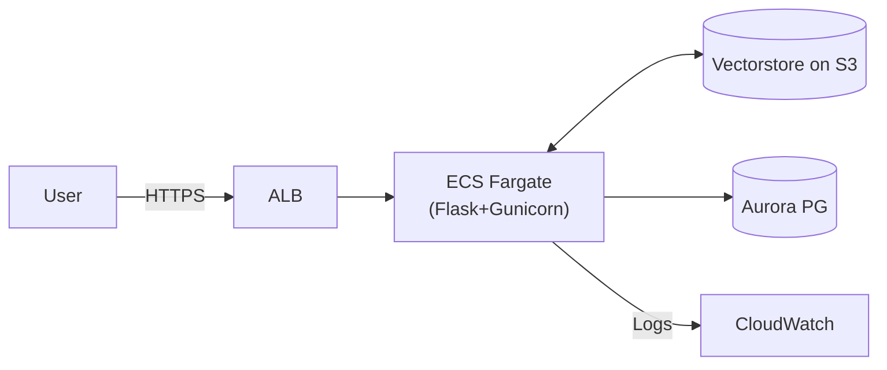
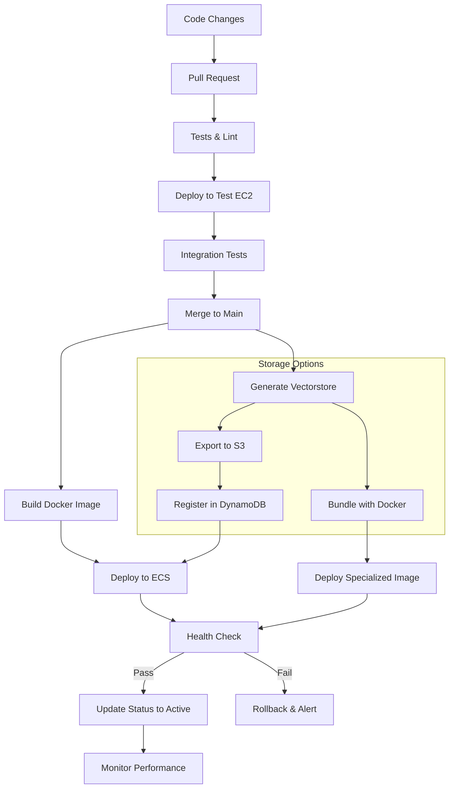

# **ETL Pipeline Overview( Data Ingestion)**

The ETL pipeline (Extract → Transform → Load) is designed to prepare regulatory web content for semantic search and retrieval-augmented generation (RAG). It consists of three primary stages:

---

### 1. Extraction Phase

#### Objective:
Scrape data from desired URL (e.g., §1024.17), follow relevant nested links, and save structured markdowns for each section with traceable metadata.

#### Components:
| Step | Script | Description |
|------|--------|-------------|
| Base Extraction | `scraper.py` | Downloads Parent(Base) pages using `AsyncWebCrawler`, and saves cleaned markdown using `save_markdown_and_mapping()`. |
| One-Hop Link Discovery | `extract_nested_links.py` | Extracts one-hop nested URLs from downloaded markdown using regex and filters irrelevant links. |
| Nested Content Scraping | `extract_nested_data.py` | Downloads content from discovered links, processes with `extract_section()` from `scraper`, and saves markdowns + metadata. |

#### Output:
- Clean markdowns: `data/markdown_files/`
- Link metadata: `data/raw/links/`
- File mapping: `url_to_file.json`

---

### 2. Transformation Phase

#### Objective:
Break down long markdown documents into chunks for vectorization and retrieval.

#### Steps:

1. **Load Markdown Files:**  
   Reads `.md` files from `data/markdown_files/`.

2. **Select Chunking Strategy:**  
   Configurable via `RAG_CONFIG["Chunk_param"]`. Supported strategies:
   - `semantic_chunking`: Sentence embeddings + fallback.
   - `sentence_token_chunking`: Sentence/token boundaries.
   - `recursive_chunking`: Character-based splitting.

3. **Wrap Chunks with Metadata:**  
   Each chunk is turned into a `LangChain Document` with:
   - `source`, `filename`, `chunk_type`, `chunk_index`

4. **Save Strategy Metadata:**  
   Each run saves a `chunk_params.json` in the vectorstore directory.

#### Output:
- In-memory documents list: `List[Document]`
- Configured chunk metadata in:  
  `data/vector_stores/<strategy>_*/chunk_params.json`

---
### 3. Load Phase

#### Objective:
Persist the document chunks into a vector store and enable efficient retrieval for question answering.

#### Steps:

1. **Vector Store Setup:**  
   Uses Chroma and openai-embeddings to create and  embed each chunk and stores them under a collection tied to its chunking strategy.

2. **Retriever Options:**
   - `BasicRetriever`: Pure embedding similarity.
   - `BM25RerankedRetriever`: Embedding + BM25 re-ranking.
   - `ReciprocalRankFusionRetriever`: Combines results via Recursice Rank Fusion.

3. **Query Handling with RAG Chain:**
   - Fetches documents using retriever.
   - Constructs prompt + context with retrieved context as reference.
   - Sends to LLM (e.g., GPT-4o-mini) for grounded response.

#### Output:
- Vector store directories: `data/vector_stores/`
- Retriever setup and prompt handling through: `RAGChain`


---

# **ETL ==> AWS Infrastructure for RAG Chatot Deployment**

This section describes the process for dumping the generated vectorstore into Amazon S3 and outlines the full AWS infrastructure required to host and operate the chatbot application on a high level.

---

## 1. Dumping Vectorstore to **Amazon S3**

1.1 **Build & Serialize Vectorstore**  
   - After transforming markdowns and generating embeddings, Chroma constructs the vectorstore in storage.  
   - Use Chroma’s built-in serialization or custom exporter to write index files and metadata to a staging directory.

1.2 **Prepare S3 Sink Configuration and Upload data**  
   - Define S3 bucket and prefix in `RAG_CONFIG`:  
   - Ensure IAM role/policy allows write to specific S3 bucket

1.3 **Validation (optional)**  
   - After upload, list S3 objects to verify successful transfer.  
---

## 2. AWS Infrastructure Overview

This section details the AWS services and architecture that would be for deploying the RAG chatbot.

 **Assumption**: The chatbot experiences intermittent usage patterns with occasional spikes (e.g., during business hours rather than constant, uniform traffic. By leveraging serverless container orchestration, we could optimize costs—paying only for compute when tasks are running—while ensuring rapid scaling during peak demand.

Advantages of going with ECS Fargate - 

- Auto-scaling & Cost Efficiency: Fargate scales containers as needed, cutting idle EC2 costs.

- Managed Infrastructure: AWS handles patching, provisioning, and cluster management.

- Support for Long-running Processes: ECS tasks can run persistent services (e.g., Gunicorn) with custom entrypoints, unlike Lambda.


| Component       | Service                | Purpose                                                       |
|-----------------|------------------------|---------------------------------------------------------------|
| **Compute**     | Amazon ECS + Fargate   | Serverless containers for chatbot API                         |
| **Load Balancer** | ALB                   | Distribute traffic, SSL termination, health checks            |
| **Database**    | Amazon RDS Aurora PG   | Persistent storage for chats, logs, feedbacks, metrics                   |
| **Networking**  | VPC, Subnets, NAT GW   | Secure network segmentation and outbound internet access      |
| **Registry**    | Amazon ECR             | Docker image storage with scanning & lifecycle policies       |
| **Observability** | CloudWatch + SNS     | Logs, metrics, alarms, notifications                          |
| **Security**    | IAM Roles, SGs         | Least-privilege access, secure network rules                  |

---

### 2.1 Compute: ECS on Fargate

- **Docker Image**: Built in CI, pushed to ECR.
- **Task Definition**: Defines container, env vars, secrets (via Secrets Manager), log config.
- **Service**: Maintains `min=2` tasks for HA, auto-scales based on CPU/memory.
- **Entrypoint**: `supervisord` runs Gunicorn → Flask app (`app.py`).

### 2.2 Load Balancer: Application Load Balancer (ALB)

- **Placement**: Public subnet
- **Listeners**: HTTP (80) → HTTPS (443) redirect
- **SSL**: ACM certificate on TLS listener
- **Health Check**: `/health` endpoint
- **Target Group**: Points to ECS tasks on port `8080`

### 2.3 Database: Aurora PostgreSQL

- **Deployment**: Multi-AZ for failover
- **Storage**:  
  - Chat logs  
  - Query history  
  - Debug & error logs  
  - Usage metrics  
  - (Optional) Langfuse ( for LLM tracing, observability ( discussed in LLM tracing))
- **Connection**: ECS tasks via Security Group
- **Credentials**: Stored in Secrets Manager

### 2.4 Networking: VPC & Subnets

- **VPC**: Custom CIDR (e.g., `10.0.0.0/16`)
- **Subnets**:
  - Public: ALB
  - Private: ECS & RDS
- **NAT Gateway**: Enables ECS tasks to call external APIs (e.g., OpenAI)
- **Route Tables**: Public subnet → IGW; Private subnet → NAT GW

### 2.5 Container Registry: ECR

- **Repo**: Private, auto-scan on push
- **Lifecycle Policy**: Retain latest N images, expire old ones
- **Permissions**: ECS tasks pull via IAM role

### 2.6 Observability: CloudWatch + SNS

- **Logs**: ECS task logs → CloudWatch Log Groups
- **Alarms**:
  - ECS CPU/Memory > thresholds
  - RDS CPU/Storage anomalies
  - ALB 5xx errors
- **Notifications**: SNS topics for email/SMS alerts

### 2.7 Security: IAM & Security Groups

| Resource        | Access Policy                                 |
|-----------------|-----------------------------------------------|
| ECS Task Role   | ECR Pull, S3 Read, Secrets Manager access     |
| ALB SG          | Ingress: 80/443 from 0.0.0.0/0                |
| ECS SG          | Ingress: 8080 from ALB SG                     |
| RDS SG          | Ingress: 5432 from ECS SG                     |

---

## 3. API Endpoints & Test Environment

### 3.1 API Endpoints (in `app.py`) -- (flask wrapped )

| Path    | Method | Purpose                       |
|---------|--------|-------------------------------|
| `/query` | POST  | Handles user queries via RAG  |
| `/health`| GET   | Health check for ALB & ECS    |

### 3.2 Test Environment (EC2-based)

To mirror production as closely as possible while allowing safe testing of new features, we cloud provision EC2-based environment:

| Instance | Role                 | Description                                      |
|----------|----------------------|--------------------------------------------------|
| `EC2-1`  | App Server           | Flask+Gunicorn+Supervisord |
| `EC2-2`  | DB Server            | PostgreSQL with dummy data                       |

- **Application**: Flask app served by Gunicorn, managed by Supervisord
- **Security Group**: Only allows port 5432 from EC2‑1 SG 
- **Networking**: Mirror prod VPC/subnet setup, SG rules identical.
- **Logs**: Local + CloudWatch Agent installed.

---

**Diagram: High-Level Traffic Flow**




# CI/CD & MLOps Pipeline

This section outlines the Continuous Integration, Continuous Deployment, and MLOps processes that could be used to move the chatbot (and its ETL artifacts) from development through test to production.

### 4.1 Multi-Branch Strategy ( original)

| Branch        | Environment        | Purpose                                    |
|---------------|--------------------|--------------------------------------------|
| `main`        | Production (ECS)   | Stable, user-facing release                |
| `test`        | Staging (EC2)      | QA and integration testing                 |
| `feature/*`   | Local/Dev          | Feature development and previews           |

<!-- ### 4.2 Production CI/CD Workflow (ECS via GitHub Actions)

1. **Trigger**: Push or merge into `main` branch.
2. **Checkout & Validate**
   - `actions/checkout@v3`
   - Run `tests` to enforce code quality & catch early bugs.
3. **Build & Test ETL Artifacts**
   - Invoke `tests/etl` to verify extraction, transformation, and vectorstore serialization logic.
4. **Build Docker Image**
   ```yaml
   - name: Build Docker
     run: docker build -t ${{ secrets.ECR_REGISTRY }}/my-chatbot:${{ github.sha }} .
   ```
5. **Push to ECR**
   ```yaml
   - name: Login to ECR
     uses: aws-actions/amazon-ecr-login@v1
   - name: Push Image
     run: |
       docker push ${{ secrets.ECR_REGISTRY }}/my-chatbot:${{ github.sha }}
   ```
6. **Export & Upload Vectorstore to S3**
   - After build, run `export_vectorstore_to_s3.py` to dump the latest vectorstore into S3 under `vectorstores/${{ github.sha }}/`.
   - Validate S3 upload by listing objects.
7. **Update & Deploy ECS**
   - Use `aws-actions/amazon-ecs-deploy-task-definition@v1` to register new Task Definition with updated image tag and S3 access IAM role.
   - Update Service to use new Task Definition.
8. **Health Verification & Rollback**
   - Poll ECS DescribeTasks until tasks are `RUNNING` and `/health` returns `200`.
   - On failure, rollback to previous Task Definition.
9. **Notification**
   - Send a Slack message or email via `actions/slack@v1` on failure.

> **MLOps Note:** Integration tests include running a sample query against a snapshot of the vectorstore in S3 to ensure RAG accuracy post-deployment.

### 4.3 Testing CI/CD Workflow (EC2 via GitHub Actions)

1. **Trigger**: Push to `test` branch or manual workflow dispatch.
2. **SSH & Deploy**
   - Use `appleboy/ssh-action@v0.1.6` to connect to EC2-1.
   - Pull latest code (`git checkout test && git pull`).
   - Run `export_vectorstore_to_s3.py --local` to regenerate vectorstore locally for EC2 staging.
3. **Restart Services**
   - `ssh ec2-1 'supervisorctl restart chatbot'`
4. **Health Check**
   - `curl --fail http://ec2-1:8080/health`
   - Fail build on non-200.
5. **Notification**
   - Post result to Slack/Email.

### 4.4 ETL Integration in CI/CD

- The **Extraction & Transformation** scripts (scraper, link extractor, vectorstore builder) are versioned alongside the app code.
- CI pipelines run unit/integration tests against these scripts to guarantee repeatability.
- After successful ETL test runs, the **export_vectorstore_to_s3.py** script is invoked in both test and prod pipelines, ensuring the vectorstore in S3 is always in sync with code changes.

### 4.5 Dockerization & Process Management

- **Dockerfile** stages:
  1. Install system & Python dependencies.
  2. Copy application and ETL scripts.
  3. Expose port `8080`.
  4. Entry: `CMD ["/usr/bin/supervisord"]`.
- **supervisord.conf**:
  ```ini
  [program:gunicorn]
  command=gunicorn app:app --bind 0.0.0.0:8080
  stdout_logfile=/dev/stdout
  stderr_logfile=/dev/stderr
  autorestart=true
  ```

### 4.6 Monitoring & Observability

- **CloudWatch Logs**: Captures ECS & EC2 logs.
- **CloudWatch Alarms**:
  - ECS CPU/Memory usage.
  - ALB 5xx error rate.
  - RDS performance thresholds.
- **SNS Topics**: Real-time alerts to Slack/email.
- **Metrics Endpoint** (optional): `/metrics` for Prometheus scraping.

<!-- ### 4.7 CI/CD Flow Diagram

```mermaid
flowchart TB
  subgraph GitHub Actions
    A[Push to main] -->

 --> -->
# New

This section outlines the Continuous Integration, Continuous Deployment, and MLOps processes designed to move the RAG chatbot (and its ETL artifacts) through development, testing, and production environments with maximum reliability and minimal friction.

## 1. Multi-Branch Strategy

| Branch        | Environment        | Purpose                                       |
|---------------|--------------------|--------------------------------------------- |
| `main`        | Production (ECS)   | Stable, user-facing release                   |
| `test`        | Staging (EC2)      | QA and integration testing                    |
| `feature/*`   | Local/Dev          | Feature development and previews              |

## 2. Vectorstore Storage Strategies

Two complementary approaches could be implemented for vectorstore management, balancing access speed and consistency:
(depending on usage )

### 2.1 S3-Based Approach
- **Advantages**: Centralized, versioned, independent scaling, disaster recovery
- **Implementation**: Vectorstores stored in S3 with version metadata
- **Access Pattern**: ECS tasks load vectors from S3 at initialization or on-demand

### 2.2 Co-located Approach 
- **Advantages**: Low-latency access, reduced dependency on network
- **Implementation**: Vectorstore bundled with container or mounted as volume
- **Tradeoffs**: Larger container size, longer build times, additional EBS costs

### 2.3 Hybrid Approach
- **Primary Storage**: S3 serves as the source of truth
- **Local Cache**: Most frequently used vectors cached in container memory/disk
- **Refresh Strategy**: Background job updates local cache from S3 periodically

## 3. Production CI/CD Workflow (ECS via GitHub Actions)

1. **Trigger**: 
   - Push or merge into `main` branch
   - Manual dispatch with parameters for vectorstore rebuild options

2. **Environment Setup & Validation** ( word description sudo implem)
   ```yaml
   - name: Checkout Code
     uses: actions/checkout@v3
   
   - name: Set up Python
     uses: actions/setup-python@v4
     with:
       python-version: '3.10'
   
   - name: Install Dependencies
     run: pip install -r requirements.txt -r requirements-dev.txt
   ```

3. **Code Quality & Tests**
   ```yaml
   - name: Lint
     run: flake8 .
   
   - name: Unit Tests
     run: pytest tests/unit
   
   - name: Security Scan
     uses: anchore/scan-action@v3
   ```

4. **ETL Pipeline Execution & Validation**
   ```yaml
   - name: ETL Unit Tests
     run: pytest tests/etl
   
   - name: Vectorstore Generation Test
     run: python -m etl.build_vectorstore --sample
   ```

5. **Build Docker Image**
   ```yaml
   - name: Build Docker Image
     run: |
       docker build \
         --build-arg BUILD_VERSION=${{ github.sha }} \
         --build-arg VECTOR_STRATEGY=${{ inputs.vector_strategy }} \
         -t ${{ secrets.ECR_REGISTRY }}/rag-chatbot:${{ github.sha }} .
   ```

6. **Vectorstore Processing**
   ```yaml
   - name: Generate & Export Vectorstore
     run: python -m etl.export_vectorstore \
       --output-path s3://${{ secrets.S3_BUCKET }}/vectorstores/${{ github.sha }}/ \
       --metadata-file metadata.json
   
   - name: Register Vectorstore Version
     run: |
       aws dynamodb put-item \
         --table-name vectorstore_versions \
         --item '{
           "version": {"S": "${{ github.sha }}"},
           "timestamp": {"S": "'$(date -u +"%Y-%m-%dT%H:%M:%SZ")'"},
           "status": {"S": "deploying"},
           "s3_path": {"S": "s3://${{ secrets.S3_BUCKET }}/vectorstores/${{ github.sha }}/"}
         }'
   ```

7. **Co-located Vectorstore (Optional)**
   ```yaml
   - name: Build With Co-located Vectorstore
     if: ${{ inputs.vector_strategy == 'colocated' }}
     run: |
       # Download vectorstore to local workspace
       aws s3 cp s3://${{ secrets.S3_BUCKET }}/vectorstores/${{ github.sha }}/ ./vectorstore/ --recursive
       
       # Build specialized image with vectorstore included
       docker build \
         --build-arg INCLUDE_VECTORS=true \
         -f Dockerfile.with-vectors \
         -t ${{ secrets.ECR_REGISTRY }}/rag-chatbot-with-vectors:${{ github.sha }} .
         
       docker push ${{ secrets.ECR_REGISTRY }}/rag-chatbot-with-vectors:${{ github.sha }}
   ```

8. **Push to ECR**
   ```yaml
   - name: Login to ECR
     uses: aws-actions/amazon-ecr-login@v1
   
   - name: Push Image
     run: docker push ${{ secrets.ECR_REGISTRY }}/rag-chatbot:${{ github.sha }}
   ```

9. **Update Configuration**
   ```yaml
   - name: Generate Task Definition
     run: |
       # Create task definition from template
       envsubst < task-definition-template.json > task-definition.json
   ```

10. **Deploy to ECS**
    ```yaml
    - name: Deploy to ECS
      uses: aws-actions/amazon-ecs-deploy-task-definition@v1
      with:
        task-definition: task-definition.json
        service: rag-chatbot-service
        cluster: rag-chatbot-cluster
        wait-for-service-stability: true
    ```

11. **Health Verification**
    ```yaml
    - name: Verify Deployment
      run: |
        # Wait for service to be stable
        aws ecs wait services-stable \
          --cluster rag-chatbot-cluster \
          --services rag-chatbot-service
        
        # Test API health endpoint
        curl --fail https://${{ secrets.ALB_DNS }}/health
        
        # Test RAG capability with sample query
        python tests/integration/test_rag_query.py \
          --endpoint https://${{ secrets.ALB_DNS }}/query \
          --expected-source-doc "source123.pdf"
    ```

12. **Update Vectorstore Status**
    ```yaml
    - name: Mark Vectorstore as Active
      run: |
        aws dynamodb update-item \
          --table-name vectorstore_versions \
          --key '{"version": {"S": "${{ github.sha }}"}}' \
          --update-expression "SET #status = :status" \
          --expression-attribute-names '{"#status": "status"}' \
          --expression-attribute-values '{":status": {"S": "active"}}'
    ```

13. **Rollback Procedure (On Failure)**
    ```yaml
    - name: Rollback on Failure
      if: failure()
      run: |
        # Get previous task definition
        PREV_TASK_DEF=$(aws ecs describe-services \
          --cluster rag-chatbot-cluster \
          --services rag-chatbot-service \
          --query 'services[0].taskDefinition' \
          --output text)
        
        # Rollback to previous task definition
        aws ecs update-service \
          --cluster rag-chatbot-cluster \
          --service rag-chatbot-service \
          --task-definition $PREV_TASK_DEF \
          --force-new-deployment
          
        # Mark vectorstore as failed
        aws dynamodb update-item \
          --table-name vectorstore_versions \
          --key '{"version": {"S": "${{ github.sha }}"}}' \
          --update-expression "SET #status = :status" \
          --expression-attribute-names '{"#status": "status"}' \
          --expression-attribute-values '{":status": {"S": "failed"}}'
    ```

14. **Notification**
    ```yaml
    - name: Notify Success
      if: success()
      uses: slackapi/slack-github-action@v1
      with:
        payload: |
          {
            "text": "✅ RAG Chatbot deployed successfully to production!\nVersion: ${{ github.sha }}\nVectorstore: ${{ inputs.vector_strategy }}"
          }
          
    - name: Notify Failure
      if: failure()
      uses: slackapi/slack-github-action@v1
      with:
        payload: |
          {
            "text": "❌ RAG Chatbot deployment failed!\nVersion: ${{ github.sha }}\nSee details: ${{ github.server_url }}/${{ github.repository }}/actions/runs/${{ github.run_id }}"
          }
    ```

## 4. Testing CI/CD Workflow (EC2 via GitHub Actions)

1. **Trigger**: 
   - Push to `test` branch
   - Pull request against `main`
   - Manual workflow dispatch

2. **Setup & Test**
   ```yaml
   - name: Run tests
     run: pytest tests/
   ```

3. **Generate Test Vectorstore**
   ```yaml
   - name: Build Test Vectorstore
     run: python -m etl.build_vectorstore --output-dir ./vectorstore --test-data
   ```

4. **Deploy to EC2**
   ```yaml
   - name: Deploy to EC2
     uses: appleboy/ssh-action@v0.1.6
     with:
       host: ${{ secrets.EC2_HOST }}
       username: ${{ secrets.EC2_USER }}
       key: ${{ secrets.EC2_SSH_KEY }}
       script: |
         cd /opt/rag-chatbot
         git fetch && git checkout test && git pull
         pip install -r requirements.txt
         
         # Copy local vectorstore to EC2
         mkdir -p /opt/rag-chatbot/vectorstore
         aws s3 cp s3://${{ secrets.S3_BUCKET }}/vectorstores/test/ /opt/rag-chatbot/vectorstore/ --recursive
         
         # Update config to use local vectorstore
         sed -i 's/VECTORSTORE_TYPE=.*/VECTORSTORE_TYPE=local/' .env
         sed -i 's/VECTORSTORE_PATH=.*/VECTORSTORE_PATH=\/opt\/rag-chatbot\/vectorstore/' .env
         
         # Restart service
         supervisorctl restart rag-chatbot
   ```

5. **Verify Deployment**
   ```yaml
   - name: Health Check
     run: |
       # Wait for service to start
       sleep 10
       
       # Check health endpoint
       curl --fail http://${{ secrets.EC2_HOST }}:8080/health
       
       # Run test queries
       python tests/integration/test_queries.py --host ${{ secrets.EC2_HOST }} --port 8080
   ```

## 5. ETL Pipeline Integration

The ETL (Extract, Transform, Load) pipeline is a critical component in RAG systems, responsible for:

1. **Document Extraction**
   - Scraping web content
   - Processing PDF/document files
   - API integration for external data sources

2. **Transformation & Chunking**
   - Text extraction and cleaning
   - Document chunking with optimal size
   - Metadata extraction and enrichment

3. **Embedding Generation**
   - Converting text chunks to vector embeddings
   - Optimizing for semantic search capability

4. **Vectorstore Creation**
   - Building searchable vector database
   - Metadata indexing for filtering
   - Serialization for storage/distribution

### 5.1 ETL Integration Points

- **Scheduled ETL Jobs**: 
  - Periodic data refresh independent of code deployments
  - Controlled via separate CI/CD pipeline
  - Results stored in timestamped S3 paths

- **On-Demand ETL**:
  - Triggered via GitHub workflow dispatch
  - Parameter-driven for targeted updates
  - Useful for hot fixes and data corrections

- **ETL Monitoring**:
  - CloudWatch metrics for embedding count, processing time
  - DynamoDB registry of available vectorstores
  - Slack notifications on completion/errors

## 6. Containerization & Resource Management

### 6.1 Dockerfile Structure

```dockerfile
# Base image
FROM python:3.10-slim

# Install system dependencies
RUN apt-get update && apt-get install -y --no-install-recommends \
    build-essential \
    supervisor \
    && rm -rf /var/lib/apt/lists/*

# Set working directory
WORKDIR /app

# Copy requirements and install dependencies
COPY requirements.txt .
RUN pip install --no-cache-dir -r requirements.txt

# Copy application code
COPY . .

# Build arguments
ARG BUILD_VERSION=dev
ARG VECTOR_STRATEGY=s3

# Environment variables
ENV BUILD_VERSION=${BUILD_VERSION} \
    VECTOR_STRATEGY=${VECTOR_STRATEGY} \
    PORT=8080

# Configure supervisord
COPY supervisord.conf /etc/supervisor/conf.d/supervisord.conf

# Expose port
EXPOSE 8080

# Command to run
CMD ["/usr/bin/supervisord", "-c", "/etc/supervisor/conf.d/supervisord.conf"]
```

### 6.2 Supervisord Configuration

```ini
[supervisord]
nodaemon=true
user=root
logfile=/dev/null
logfile_maxbytes=0

[program:gunicorn]
command=gunicorn app:app --bind 0.0.0.0:8080 --workers 4 --threads 2
stdout_logfile=/dev/stdout
stdout_logfile_maxbytes=0
stderr_logfile=/dev/stderr
stderr_logfile_maxbytes=0
autorestart=true

[program:vector-sync]
command=python -m utils.vector_sync_service
stdout_logfile=/dev/stdout
stdout_logfile_maxbytes=0
stderr_logfile=/dev/stderr
stderr_logfile_maxbytes=0
autorestart=true
```

## 7. Monitoring & Observability

### 7.1 Key Metrics

- **Application Performance**:
  - Request latency (p50, p90, p99)
  - Query throughput
  - Error rates

- **RAG-Specific Metrics**:
  - Vector retrieval latency
  - Relevance scores
  - Token usage (for LLM)
  - Cache hit/miss rates

- **Resource Utilization**:
  - CPU/Memory usage
  - S3 GET requests
  - Network I/O

### 7.2 Logging Strategy

- **Structured JSON Logs**:
  - Request ID for traceability
  - User query (anonymized)
  - Retrieved documents
  - LLM prompt tokens
  - Response generation time

- **Log Destinations**:
  - CloudWatch Logs
  - Optional ELK/DataDog integration

### 7.3 Alerting

- **CloudWatch Alarms**:
  - 5xx error rate > 1%
  - p99 latency > 2s
  - ECS service < 100% healthy tasks

- **Custom RAG Alerts**:
  - Zero vector results > 10% of queries
  - LLM token usage spike
  - Vectorstore access errors

## 8. CI/CD Pipeline Diagram



## 9. Deployment Configuration

### 9.1 ECS Task Definition

The task definition includes environment variables that control how the container accesses vectorstore data:

```json
{
  "containerDefinitions": [
    {
      "name": "rag-chatbot",
      "image": "{{ ECR_REGISTRY }}/rag-chatbot:{{ GITHUB_SHA }}",
      "essential": true,
      "environment": [
        {
          "name": "VECTORSTORE_TYPE",
          "value": "{{ VECTOR_STRATEGY }}"
        },
        {
          "name": "VECTORSTORE_S3_PATH",
          "value": "s3://{{ S3_BUCKET }}/vectorstores/{{ GITHUB_SHA }}/"
        },
        {
          "name": "VECTORSTORE_LOCAL_PATH",
          "value": "/app/vectorstore"
        },
        {
          "name": "CACHE_STRATEGY",
          "value": "hybrid"
        },
        {
          "name": "CACHE_TTL_SECONDS",
          "value": "3600"
        }
      ],
      "portMappings": [
        {
          "containerPort": 8080,
          "hostPort": 8080,
          "protocol": "tcp"
        }
      ],
      "logConfiguration": {
        "logDriver": "awslogs",
        "options": {
          "awslogs-group": "/ecs/rag-chatbot",
          "awslogs-region": "{{ AWS_REGION }}",
          "awslogs-stream-prefix": "ecs"
        }
      }
    }
  ],
  "executionRoleArn": "arn:aws:iam::{{ AWS_ACCOUNT_ID }}:role/ecsTaskExecutionRole",
  "taskRoleArn": "arn:aws:iam::{{ AWS_ACCOUNT_ID }}:role/rag-chatbot-task-role",
  "family": "rag-chatbot",
  "networkMode": "awsvpc",
  "requiresCompatibilities": ["FARGATE"],
  "cpu": "1024",
  "memory": "2048"
}
```

## 10. Alternative Approaches & Considerations

### 10.1 Vector Database Services

As an alternative to S3 storage, consider using managed vector database services:

- **Pinecone**: Managed vector search with high availability
- **Redis with RedisSearch**: In-memory vector search with persistence
- **OpenSearch Vector Engine**: Combined full-text and vector search

### 10.2 Serverless RAG Architecture

For lower traffic scenarios, a serverless approach could be implemente

